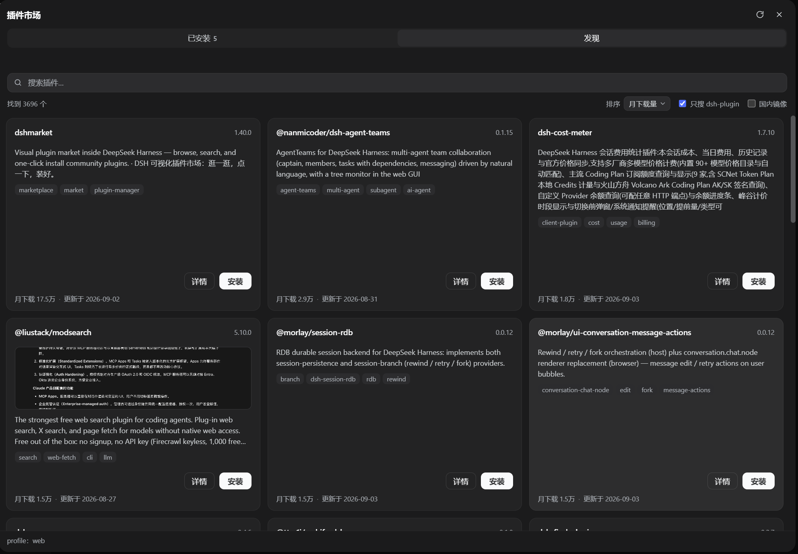
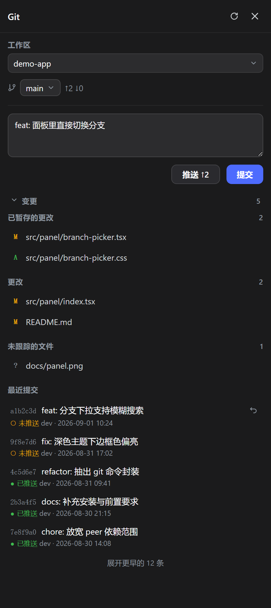
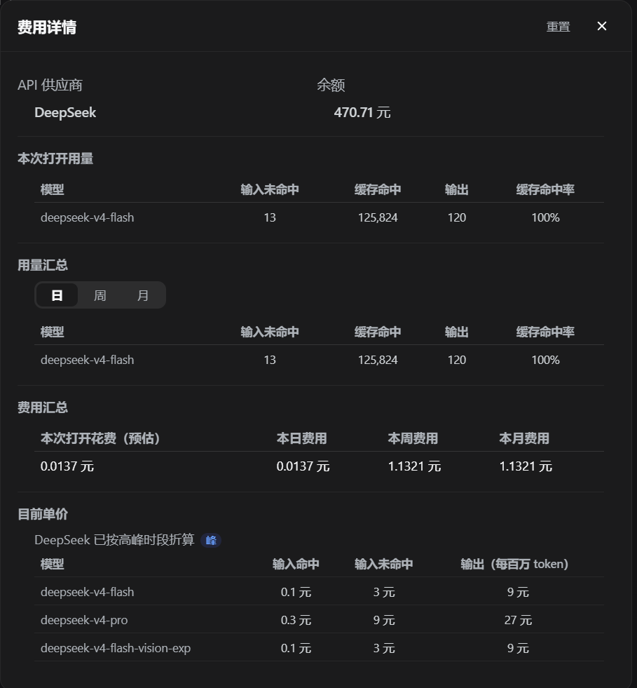

# DeepSeek Harness Desktop

以 [DeepSeek Harness](https://github.com/deepseek-ai/deepseek-harness)（下称 `dsh`）为内核的桌面版 AI 编程助手，支持 **Windows · Linux · macOS**。

**双击即用 —— 不需要装 Node.js，不需要懂命令行。**

<p align="center">
  <a href="https://github.com/EasyTZ/dsh-desktop/releases/latest"></a>
  
  
  
</p>

<p align="center">
  
</p>

<details>
<summary><b>查看浅色主题</b></summary>
<br>
<p align="center"></p>
</details>

---

## 📥 下载与安装

到 [Releases 页面](https://github.com/EasyTZ/dsh-desktop/releases/latest)下载对应你系统的那个：

| 平台 | 文件 | 怎么用 |
|---|---|---|
| **Windows** | `...-Setup-x.x.x.exe` | **安装包**：一路「下一步」，装完有桌面图标 —— 新手选这个 |
| **Windows** | `...-Portable-x.x.x.zip` | **绿色版**：解压即用，免安装，适合放 U 盘 |
| **Linux** x64 | `...-x.x.x.AppImage` | `chmod +x` 之后双击或命令行运行，不用安装 |
| **macOS** Apple Silicon | `...-x.x.x.dmg` | 打开后按图示拖进「应用程序」；首次启动按 DMG 内的安全放行步骤操作 |

<details>
<summary><b>各平台的首次启动提示（点开看）</b></summary>

<br>

**Windows**：本程序没有购买代码签名证书，系统可能提示「未知发布者」，或被杀毒软件拦一下 —— 选择「仍要运行 / 允许」即可。

**macOS**：当前使用免费的 ad-hoc 签名，没有 Developer ID 与 Apple 公证，首次打开时 Gatekeeper 会拦截。先尝试双击一次，然后进入**系统设置 → 隐私与安全 → 安全性 → 仍要打开**，验证密码并确认「打开」。DMG 安装窗口里也会直接显示这三步。

> 只提供 Apple Silicon（M 系列）版本，Intel Mac 暂不支持。

**Linux**：AppImage 自挂载需要 FUSE 2（`libfuse.so.2`）。如果双击 / 执行没反应，先试 `./xxx.AppImage --appimage-extract-and-run` —— 能跑就说明是 FUSE 的事，装一下发行版的 fuse 包即可。另外需要 GTK3 / NSS / ALSA 这些常见图形库，装了桌面环境的发行版基本都有；真缺的话报错会写明缺哪个 `.so`，按名字装。

部分桌面环境不带 libappindicator，那样不会有托盘图标 —— 应用照常运行，用 `Ctrl + Alt + Space` 唤出窗口即可。

</details>

---

## ✨ 它能做什么

### 开箱即用，不折腾环境

包里自带完整运行环境（`node` + `dsh` 内核），**装好就能聊**。拷到另一台没装过任何东西的电脑上，照样跑。

### 内核可以单独升级，不用等我们发版

「内核」是真正干活的 dsh 本体，它和桌面版**分成两条线升级**。上游发了新版，你在客户端里点一下就升级了。

更新前会**真实启动一次新内核做自检**，失败自动回滚 —— 不会把能用的装成不能用的。

### 常驻后台，随叫随到

关窗口自动缩进托盘，`Ctrl + Alt + Space`（macOS 是 `Cmd + Alt + Space`）随时唤出。任务跑完或需要你确认时，窗口在后台会弹系统通知并闪任务栏，不用守着屏幕。

### 应用本身有新版也会提醒

系统通知 + 托盘菜单，点开直达发布页。装还是不装，仍由你决定。

---

## 🧩 四个内置面板，一处完成开发工作

每个面板都沿用 dsh 的主题、圆角与交互，不再把四张比例不同的截图硬塞进四宫格。

### 🛒 插件市场 · 安装、更新与管理

搜索 npm 上的 dsh 插件，查看详情和截图，一键安装、更新、停用或卸载。随桌面版分发的插件即使卸载，也能从本地副本离线装回。

<p align="center"></p>

---

### 🌿 Git 面板 · 日常操作不用离开会话

查看改动、逐文件暂存、提交、推送与切换分支；最近提交明确区分已推送和未推送状态，点开即可检查完整改动。

<p align="center"></p>

---

### 💻 终端面板 · 命令与输出留在工作区

在当前工作区运行命令并查看实时输出，支持多标签、命令历史、路径补全和 `Ctrl+C` 中断；后台任务结束后会用状态灯提醒。

<p align="center"></p>

---

### 💰 余额与花费 · 用量随时可见

侧边栏直接显示账户余额和本次花费；详情面板按模型汇总 token、日/周/月用量与当前单价，不必切换到账单网页。

<p align="center"></p>

还有一个 **「在资源管理器中打开」** —— 右键文件直接跳到系统文件管理器（Windows 资源管理器 / macOS 访达 / Linux 文件管理器）。

> 这些插件都装在你自己的 dsh 配置目录里，和你从市场装的第三方插件是同一套机制 —— 换内核不影响它们，你也可以随时卸掉。

---

## 🚀 开始使用

**第一次启动**：双击图标后会先出现启动窗口（logo + 加载动画），几秒后自动进入主界面 —— 这是程序在后台铺开内核并拉起本地服务，只会慢这一次。

**填 API Key（必做）**：点左下角齿轮 →「模型」→ 填入 DeepSeek API Key（形如 `sk-xxxx`，在 [platform.deepseek.com](https://platform.deepseek.com) 申请）→ 保存。不填也能打开界面，但一发消息就会失败。

<p align="center">
  
</p>

| | |
|---|---|
| **关窗口不等于退出** | 点 ✕ 只是缩进托盘，右键托盘图标才是「退出」 |
| **随时唤出** | `Ctrl + Alt + Space`（macOS 是 `Cmd + Alt + Space`） |
| **反馈问题** | 右键托盘图标 →「反馈问题」，直达 GitHub Issues |

---

## 🔄 内核更新

- **自动检查**：每天后台查一次，有新版会弹更新窗口；也可右键托盘 →「检查内核更新」手动查。
- **更新流程**：点「立即更新」→ 等进度走完 → 点「立即重启」生效（选「稍后」也行，下次启动自动用新版）。
- **下载源**：默认国内镜像 `registry.npmmirror.com`，更新窗口底部可切到官方源。
- **不会更新坏**：新内核先通过真实启动自检才会启用，异常时自动回退到自带内核。

---

## ❓ 常见问题

| 现象 | 原因 / 处理 |
|---|---|
| 窗口关了找不到了 | 在托盘里，点一下图标即可 |
| 余额显示「查询失败」 | 没填 API Key，去「设置 → 模型」补上 |
| 双击没反应 / 被拦截 | 没做代码签名。Windows 选「仍要运行」；macOS **右键 →「打开」**；杀软误报可加白名单 |
| 从旧版升级后首次启动偏慢 | 正在切换到新版内核，等几秒，只会发生一次 |
| 启动失败并弹出错误框 | 错误框里有原因摘要；多为内核损坏，可在更新窗口点更新重装内核 |
| 装了插件但没反应 | 插件要重启内核才生效，右键托盘 → 退出后重新打开 |
| 装了某个插件后启动就崩 | 崩溃提示框上点「安全模式启动」，进去把它停用或卸载，再正常重启 |
| Linux 上没有托盘图标 | 桌面环境不带 libappindicator。应用照常运行，用快捷键唤出窗口 |

---

## 💬 反馈与交流

用着有问题、有想要的功能，欢迎随时提 —— 这个项目就是靠反馈改进的。

- **报 bug / 提需求**：[提交 Issue](https://github.com/EasyTZ/dsh-desktop/issues)，客户端托盘菜单里的「反馈问题」可直接跳转。
- **QQ 群**：群号 `263261649`

  

**更新日志**：见 [CHANGELOG.md](CHANGELOG.md) 或 [Releases 页面](https://github.com/EasyTZ/dsh-desktop/releases)。

---
---

# 🧑‍💻 开发者文档

> **普通用户看到这里就够了**，下面是给想改代码、想自己打包的人看的。
>
> 架构设计、插件契约与踩坑记录详见 [CLAUDE.md](CLAUDE.md) 与 [docs/decisions/](docs/decisions/)。

## 环境准备

**只要 [Node.js](https://nodejs.org) ≥ 22。**

不需要全局装 `dsh` 或 `pnpm` —— 内核由 `prepare-kernel` 按 `kernel-src/` 里声明的精确版本联网 `npm ci` 装出来，跟打包机上碰巧装了什么无关（理由见 [packaging.md](docs/decisions/packaging.md)）。

> 国内网络下载 Electron 与打包工具很慢，建议先设镜像：
> ```powershell
> $env:ELECTRON_MIRROR="https://npmmirror.com/mirrors/electron/"
> $env:ELECTRON_BUILDER_BINARIES_MIRROR="https://npmmirror.com/mirrors/electron-builder-binaries/"
> ```
> 注意 **electron 44 起包里没有 postinstall**，`npm install` 并不会下载 Electron 二进制；真正下载它的是 `npm run dist`（`dist.mjs` 会在调 electron-builder 之前自己补上，幂等）。

克隆后建议启用仓库自带的 git 钩子（`git config` 不随仓库走，每份克隆各做一次）：

```powershell
git config core.hooksPath .githooks
```

只有一个钩子：`commit-msg` 会剥掉提交消息末尾的机器署名 trailer（`Co-Authored-By: ...@anthropic.com`、`🤖 Generated with ...`）。本仓库的提交消息只描述改动、不带署名，而写消息的工具各有各的默认行为，靠约定管不住 —— 放在钩子里才是无论谁怎么写都生效。人类协作者的 `Co-Authored-By` 不受影响。

## 常用命令

```powershell
npm install              # 装依赖（不含 Electron 二进制，见上）
npm start                # 开发态运行（外壳 spawn 本机全局 dsh）
npm test                 # 单元测试（node:test，零第三方依赖）
npm run typecheck        # tsc --checkJs 静态检查（无编译产物）
npm run dist             # 打包 → 产物收进 release/（目标平台按当前系统猜）
npm run dist -- --linux  # 显式指定目标平台（--win / --linux / --mac）
npm run dist:dir         # 只出 unpacked 目录，快速验证打包态
npm run link-plugins     # 联调插件：改同级插件仓库的代码即刻生效（可常开）
npm run plugins-status   # 看插件当前是「钉 tag」还是「联调」
```

`npm run dist` 依次执行 校验插件 pin → 装内核 → 打插件 tgz → **内核自检** → 打包 → 收产物。中间那步自检会**真的把内核启动一次**等它就绪，这是唯一能挡住「裁剪把运行时真要用的文件删掉了」这类错误的手段。

## 发版走 CI

```powershell
# 1. 改 package.json 的 version
# 2. 在 CHANGELOG.md 顶部加一节
git tag v1.2.3
git push origin v1.2.3
```

推 tag 触发 [`release.yml`](.github/workflows/release.yml)：Windows / Linux / macOS 三个 job 并行打包，各自跑完整条流水线（含内核自检），产物汇合后由 `publish` job 一次性发布到 Releases，**发布说明自动取 CHANGELOG 里对应版本那一节**。

发布成功后 `publish` job 会**删掉旧的 Release，只留最新这一个**；**tag 一律保留** —— tag 是构建凭据，留着才能从任意历史版本重新出包，而每版三平台产物近 1GB，攒着只会让人下错版本。

**日常 `git push` 不会发版**，只会跑 [`ci.yml`](.github/workflows/ci.yml)（测试 + 类型检查）。本地 `npm run dist` 保留，作为打 tag 前的快速验证。

> 为什么打包非要上 CI：内核自检只能在**目标平台**上做，而多端意味着要在三个平台上各做一次。跨平台交叉打包做不到这件事。详见 [multiplatform.md](docs/decisions/multiplatform.md)。

## 插件开发

五个插件都是[独立仓库](https://github.com/EasyTZ?tab=repositories&q=dsh-)，以 `@easytz/*` 发布到 npm，本仓库按钉住的 tag 作为 git 依赖引用，只为打成 tgz 放进安装包。

它们**装在用户的 dsh profile 里**（`~/.dsh/profiles/web/`），和用户从插件市场装的第三方插件是同一套机制、同一个目录 —— 换内核不影响它们，用户也能自己卸载（市场本身除外，它是管理入口）。

想改插件代码：把对应仓库克隆到本仓库的同级目录，跑 `npm run link-plugins`，之后改完**直接生效**（改界面代码内核会自动热重载，改服务端代码重启内核），不必每次 push + 打 tag。联调可以常开 —— `npm run dist` 会自动临时解除、打完恢复，并在你有未提交的插件改动时中止（否则打出的包用的是钉住的旧版本，不含你的改动）。

**只更新插件不用发 app**：插件仓库打 tag + `npm publish` 之后，已装用户的侧边栏就会出现更新角标。随包的那份 tgz 只影响新装用户，可以攒到下次发 app 时一起带上。

## 架构

Electron 外壳 + 自包含 dsh 内核。外壳**不渲染任何业务 UI** —— `spawn` 内核后轮询 HTTP 就绪，再让 `BrowserWindow` 加载本地回环地址；所有会话 / 文件 / 终端能力都来自 dsh 自身的 web 应用，外壳只负责窗口、标题栏、托盘、快捷键、通知与内核更新。

```
src/main/     Electron 主进程
src/preload/  预加载脚本（注入标题栏 / 暴露 updater 接口）
src/shared/   纯 Node 模块，主进程与构建脚本共用，也是单测落点
scripts/      构建期 CLI（ESM）
kernel-src/   内核的安装规格（版本声明 + lockfile），不是内核本身
plugins/      profile-plugins.json（随包分发哪几个插件的清单）
```

本项目**没有编译步骤**，`src/` 直接打进 asar —— 这是打包设计的承重墙。

---

## License

[MIT](LICENSE)
