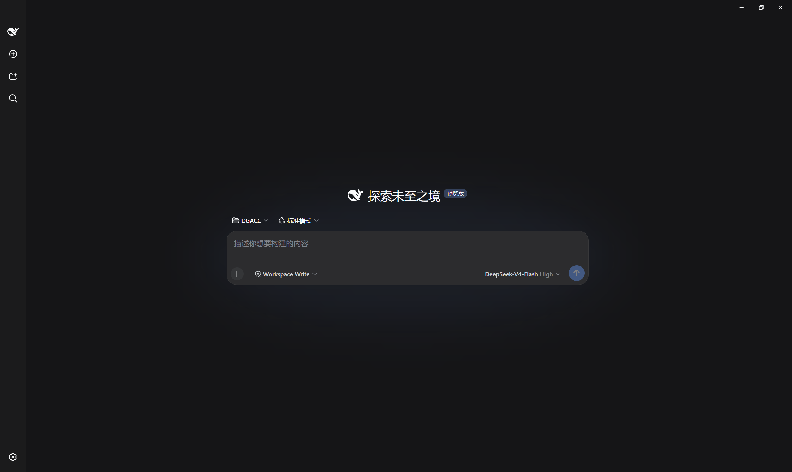
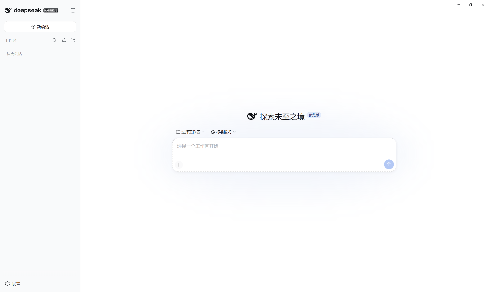
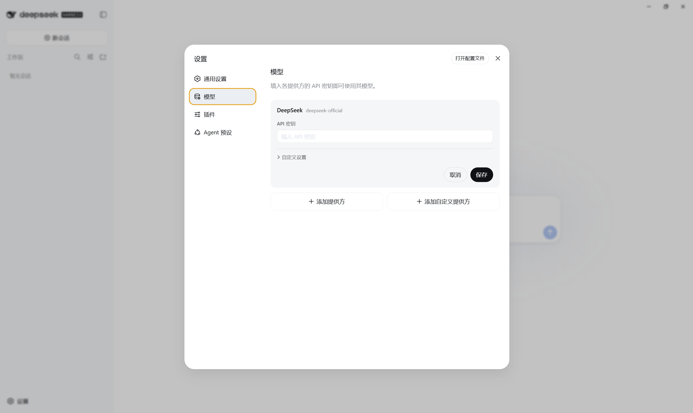
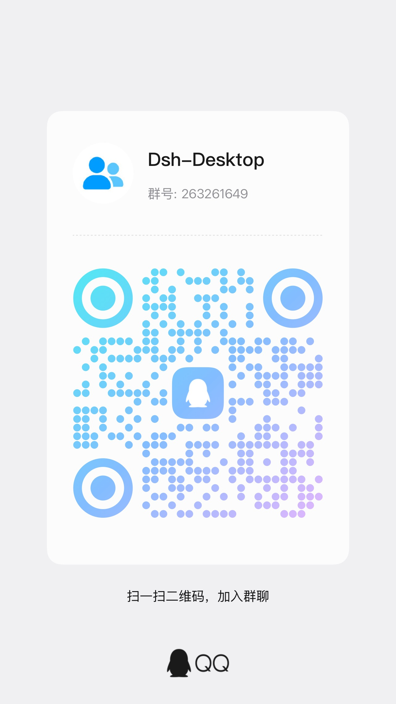

# DeepSeek Harness Desktop

以 [DeepSeek Harness](https://github.com/deepseek-ai/deepseek-harness)（下称 `dsh`）为内核的 Windows 桌面版 AI 编程助手。**双击即用，不需要装 Node.js、不需要懂命令行。**

<p align="center">
  
</p>

<p align="center">
  <sub>浅色主题：</sub><br>
  
</p>

<p align="center">
  <a href="https://github.com/EasyTZ/dsh-desktop/releases/latest"><b>⬇️ 下载最新版</b></a>
</p>

---

## ✨ 亮点

- **零配置，开箱即用** —— 自带完整运行环境（`node` + `dsh`），装好就能聊，拷到别的电脑也照样跑。
- **内核独立热更新** —— dsh 上游发了新版，在客户端里一键升级即可，不用等桌面版发版。更新前会真实启动自检，失败自动回滚，不会把能用的装成不能用的。
- **应用本身有新版会提醒你** —— 系统通知 + 托盘菜单，点开直达发布页；安装还是不装，仍由你决定。
- **常驻后台，随叫随到** —— 关窗口自动缩进托盘，`Ctrl + Alt + Space` 全局唤出。
- **跑完主动提醒** —— 窗口在后台时，任务完成或需要你确认会弹系统通知并闪烁任务栏，不用守着屏幕。
- **随手看余额和花费** —— 侧边栏一行字直接看 DeepSeek 账户余额，点开还能看本次打开应用的用量和预估花费，按当前用的模型分开算，不用切到网页查。
- **Git 面板 + 终端，都在侧边栏** —— 改了哪些文件、暂存、提交、推送、切分支，点几下就完事；终端能在当前工作区敲命令、看实时输出、Tab 补全路径与命令名。
- **插件市场** —— 侧边栏直接搜、直接装，不用碰命令行。自带的几个插件也在这里管，可以随时停用或卸载，卸了还能一键装回来。
- **完整 dsh 能力** —— 会话、文件、终端、搜索、子代理，一个不少。
- **原生桌面观感** —— 无边框窗口 + 自定义标题栏，浅色 / 深色 / 跟随系统主题。

---

## 📥 下载与安装

到 [Releases 页面](https://github.com/EasyTZ/dsh-desktop/releases)下载**任选一个**：

| 文件 | 选它的理由 |
|---|---|
| `...-Setup-x.x.x.exe` | **安装包**：一路「下一步」，装完有桌面图标，新手选这个 |
| `...-Portable-x.x.x.zip` | **绿色版**：解压即用，免安装，适合放 U 盘 |

> 本程序没有做代码签名，Windows 可能提示「未知发布者」或被杀软拦一下，选择「仍要运行 / 允许」即可。

---

## 🚀 开始使用

**第一次启动**：双击图标后会先出现启动窗口（logo + 加载动画），几秒后自动进入主界面 —— 这是程序在后台拉起本地服务，属正常现象。

**填 API Key（必做）**：点左下角齿轮 → 打开「模型」→ 填入 DeepSeek API Key（形如 `sk-xxxx`，在 [platform.deepseek.com](https://platform.deepseek.com) 申请）→ 保存。不填也能打开界面，但一发消息就会失败。

<p align="center">
  
</p>

**日常使用**：

| | |
|---|---|
| **关窗口不等于退出** | 点 ✕ 只是缩进右下角托盘，右键托盘图标才是「退出」 |
| **随时唤出** | `Ctrl + Alt + Space` 显示 / 隐藏窗口 |
| **反馈问题** | 右键托盘图标 →「反馈问题」，直达 GitHub Issues |

---

## 🔄 内核更新

「内核」就是真正干活的 dsh 本体，**它和桌面版分开升级** —— 桌面版没发新版，内核也能保持最新。

- **自动检查**：每天后台检查一次，有新版会弹出更新窗口；也可右键托盘 →「检查内核更新」手动查。
- **更新流程**：点「立即更新」→ 等进度走完 → 点「立即重启」生效（选「稍后」也行，下次启动自动用新版）。
- **下载源**：默认国内镜像 `registry.npmmirror.com`，更新窗口底部可切换到官方源。
- **不会更新坏**：新内核先通过真实启动自检才会启用，异常时自动回退到自带内核，不影响使用。

---

## ❓ 常见问题

| 现象 | 原因 / 处理 |
|---|---|
| 窗口关了找不到了 | 在右下角托盘，点一下图标即可 |
| 余额显示「查询失败」 | 没填 API Key，去「设置 → 模型」补上 |
| 双击没反应 / 被拦截 | 没做代码签名，选「仍要运行」；杀软误报可加白名单 |
| 从旧版升级后首次启动偏慢 | 正在自动切换到新版内核，等几秒即可，只会发生一次 |
| 启动失败并弹出错误框 | 错误框里有原因摘要；多为内核损坏，可在更新窗口点更新重装内核 |
| 装了插件但没反应 | 插件要重启内核才生效，右键托盘 → 退出后重新打开 |
| 装了某个插件后启动就崩 | 崩溃提示框上点「安全模式启动」，进去把它停用或卸载，再正常重启 |

---

## 💬 反馈与交流

用着有问题、有想要的功能，欢迎随时提 —— 这个项目就是靠反馈改进的。

- **报 bug / 提需求**：[提交 Issue](https://github.com/EasyTZ/dsh-desktop/issues)，客户端托盘菜单里的「反馈问题」可直接跳转。
- **QQ 群**：群号 `263261649`

  

---

## 📝 更新日志

见 [CHANGELOG.md](CHANGELOG.md)，或 [Releases 页面](https://github.com/EasyTZ/dsh-desktop/releases)。

---

## 🧑‍💻 开发

> 仅开发者需要，普通用户跳过。架构设计、插件契约与踩坑记录详见 [CLAUDE.md](CLAUDE.md)。

**前置条件**：[Node.js](https://nodejs.org) ≥ 22，并全局安装 dsh 与 pnpm：

```powershell
npm install -g @deepseek-ai/dsh
npm install -g pnpm
```

> 国内网络下载 Electron 慢，可先设镜像：
> ```powershell
> $env:ELECTRON_MIRROR="https://npmmirror.com/mirrors/electron/"
> $env:ELECTRON_BUILDER_BINARIES_MIRROR="https://npmmirror.com/mirrors/electron-builder-binaries/"
> ```

**常用命令**：

```powershell
npm install              # 装依赖（首次会下 Electron）
npm start                # 开发态运行（外壳 spawn 本机全局 dsh）
npm test                 # 单元测试（node:test，零第三方依赖）
npm run typecheck        # tsc --checkJs 静态检查（无编译产物）
npm run dist             # 打包 → 产物收进 release/
npm run dist:dir         # 只出 win-unpacked，快速验证打包态
npm run link-plugins     # 联调插件：改同级插件仓库的代码即刻生效（可常开）
npm run plugins-status   # 看插件当前是「钉 tag」还是「联调」
```

`npm run dist` 会依次执行 校验插件 pin → prepare-kernel → 打插件 tgz → 内核自检 → 打包，产物落在 `release/`。

**插件开发**：五个插件（插件市场、Git 面板、终端面板、余额显示、在资源管理器中打开）都是[独立仓库](https://github.com/EasyTZ?tab=repositories&q=dsh-)，以 `@easytz/*` 发布，本仓库按钉住的 tag 作为 git 依赖引用，只为打成 tgz 放进安装包。

它们**装在用户的 dsh profile 里**（`~/.dsh/profiles/web/`），和你从插件市场装的第三方插件是同一套机制、同一个目录 —— 换内核不影响它们，用户也能自己卸载（市场本身除外，它是管理入口）。

想改插件代码：把对应仓库克隆到本仓库的同级目录，跑 `npm run link-plugins`，之后改完**直接生效**（改界面代码内核会自动热重载，改服务端代码重启内核），不必每次 push + 打 tag。联调可以常开——`npm run dist` 会自动临时解除、打完恢复，并在你有未提交的插件改动时中止（否则打出的包用的是钉住的旧版本，不含你的改动）。

**架构**：Electron 外壳 + 自包含 dsh 内核。外壳**不渲染任何业务 UI** —— `spawn` 内核后轮询 HTTP 就绪，再让 `BrowserWindow` 加载本地回环地址；所有会话 / 文件 / 终端能力都来自 dsh 自身的 web 应用，外壳只负责窗口、标题栏、托盘、快捷键、通知与内核更新。

```
src/main/     Electron 主进程
src/preload/  预加载脚本（注入标题栏 / 暴露 updater 接口）
src/shared/   纯 Node 模块，主进程与构建脚本共用，也是单测落点
scripts/      构建期 CLI（ESM）
plugins/      profile-plugins.json（随包分发哪几个插件的清单，插件本身在独立仓库）
```

本项目**没有编译步骤**，`src/` 直接打进 asar —— 这是打包设计的承重墙。

---

## License

[MIT](LICENSE)
